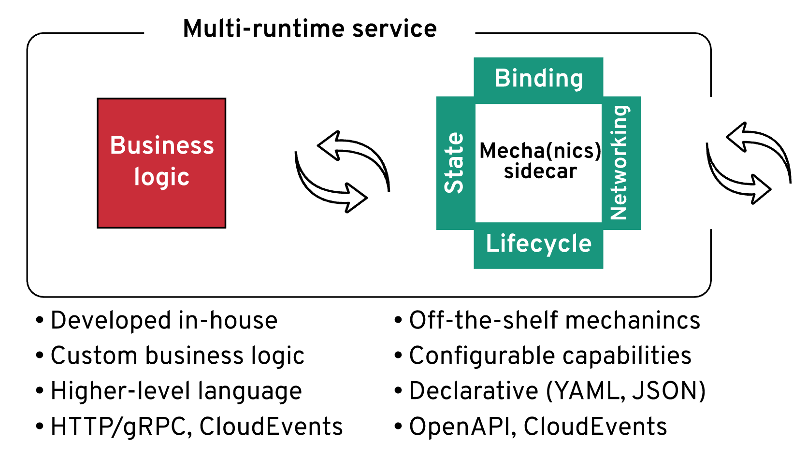

## Sidecars and operators could become a mainstream software distribution and consumption model and in some cases even replace software libraries and frameworks
 
[Operators and Sidecars Are the New Model for Software Delivery](https://hyp.is/JsOPDJuNEeuBKIvze3YQ9Q/thenewstack.io/operators-and-sidecars-are-the-new-model-for-software-delivery/)
## Organizing the application responsibilities by composing capabilities from different processes rather than including them into a single application runtime as dependencies.
### This is a change from application servers to Kubernetes as the distributed runtime.
### Rather than language-specific standards and APIs we will have polyglot APIs.
## An operator encapsulates platform and domain knowledge of an application in a declaratively configured component to manage the workload.
### Capabilities will be delivered with the management layer in the form of operators.
## https://cdn.thenewstack.io/media/2020/05/118838e1-softwareconsumers-1.png{:height 313, :width 626}
##
