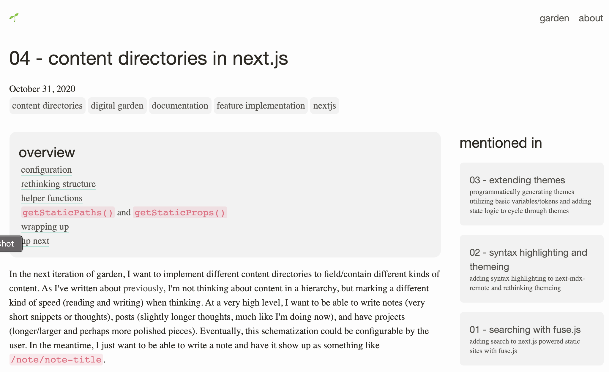

## Tailwind Nextjs Starter Blog
### [GitHub](https://github.com/timlrx/tailwind-nextjs-starter-blog)
### [Demo](https://tailwind-nextjs-starter-blog.vercel.app/)
### ~/Documents/Project/Nextjs/tailwind-nextjs
### 
#+BEGIN_SRC Shell
manfredsteiner@Manfreds-MacBook-Pro tailwind-nextjs % yarn
yarn install v1.22.10
info No lockfile found.
warning package-lock.json found. Your project contains lock files generated by tools other than Yarn. It is advised not to mix package managers in order to avoid resolution inconsistencies caused by unsynchronized lock files. To clear this warning, remove package-lock.json.
[1/4] 🔍  Resolving packages...
[2/4] 🚚  Fetching packages...
[3/4] 🔗  Linking dependencies...
warning " > file-loader@6.2.0" has unmet peer dependency "webpack@^4.0.0 || ^5.0.0".
[4/4] 🔨  Building fresh packages...
success Saved lockfile.
$ husky install
husky - not a Git repository, skipping hooks installation
✨  Done in 76.25s.
manfredsteiner@Manfreds-MacBook-Pro tailwind-nextjs % yarn dev
yarn run v1.22.10
$ next dev
ready - started server on 0.0.0.0:3000, url: http://localhost:3000
info  - Using webpack 5. Reason: future.webpack5 option enabled https://nextjs.org/docs/messages/webpack5

warn - You have enabled the JIT engine which is currently in preview.
warn - Preview features are not covered by semver, may introduce breaking changes, and can change at any time.
event - compiled successfully
wait  - compiling...
event - compiled successfully
event - build page: /
wait  - compiling...
event - compiled successfully
#+END_SRC
### http://localhost:3000
### 
## Garden
### [Github](https://github.com/inadeqtfuturs/garden)
### [Demo](https://digital-garden.dev/)
### ~/Documents/Project/Nextjs/garden
###
#+BEGIN_SRC Shell
manfredsteiner@Manfreds-MacBook-Pro garden % yarn
yarn install v1.22.10
[1/4] 🔍  Resolving packages...
[2/4] 🚚  Fetching packages...
[3/4] 🔗  Linking dependencies...
warning " > @theme-ui/prism@0.3.0" has incorrect peer dependency "theme-ui@^0.2.0".
warning "next > use-subscription@1.5.0" has incorrect peer dependency "react@^17.0.0".
warning " > @storybook/addon-essentials@6.0.28" has incorrect peer dependency "react-is@^16.8.0".
warning "@storybook/addon-essentials > @storybook/addon-docs@6.0.28" has incorrect peer dependency "react-is@^16.8.0".
warning "@storybook/react > react-docgen-typescript-plugin@0.5.2" has unmet peer dependency "typescript@>= 3.x".
warning "@storybook/react > react-docgen-typescript-plugin > react-docgen-typescript@1.20.5" has unmet peer dependency "typescript@>= 3.x".
warning "@storybook/react > react-docgen-typescript-plugin > react-docgen-typescript-loader@3.7.2" has unmet peer dependency "typescript@*".
warning " > babel-loader@8.1.0" has unmet peer dependency "webpack@>=2".
warning " > eslint-config-airbnb@18.2.0" has unmet peer dependency "eslint-plugin-react-hooks@^4 || ^3 || ^2.3.0 || ^1.7.0".
[4/4] 🔨  Building fresh packages...
✨  Done in 76.84s.
manfredsteiner@Manfreds-MacBook-Pro garden % yarn dev
yarn run v1.22.10
$ next dev
Browserslist: caniuse-lite is outdated. Please run:
npx browserslist@latest --update-db
ready - started server on http://localhost:3000
Browserslist: caniuse-lite is outdated. Please run:
npx browserslist@latest --update-db
info  - Using external babel configuration from /Users/manfredsteiner/Documents/Projects/Nextjs/garden/babel.config.js
Browserslist: caniuse-lite is outdated. Please run:
npx browserslist@latest --update-db

Why you should do it regularly:
https://github.com/browserslist/browserslist#browsers-data-updating
event - compiled successfully
event - build page: /
wait  - compiling...
event - build page: /next/dist/pages/_error
Browserslist: caniuse-lite is outdated. Please run:
npx browserslist@latest --update-db

Why you should do it regularly:
https://github.com/browserslist/browserslist#browsers-data-updating
event - compiled successfully
#+END_SRC
## http://localhost:3000
## 
