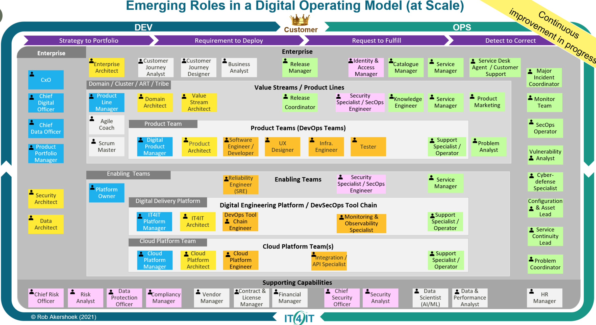

## [OpenGroup IT4IT: Emerging Roles in a Digital Operating Model](https://twitter.com/RobAkershoek/status/1386319346998317058/photo/1)
### 
## Obsidian WYSIWYM (_What You See Is What You Mean_)
### [Wikipedia: WYSIWYM](https://www.wikiwand.com/en/WYSIWYM)
### [Theme: Obsidian Graphite Coast](https://github.com/owenvachell/Obsidian-Graphite-Coast)
#### Turn off any themes already in use.
#### Create a snippets directory in the .obsidian directory inside your vault. You may need to turn on viewing for hidden directory's if the .obsidian directory isn't visible.
#### Download style.css from this repo to the snippets directory just created.
#### Go to the Appearance settings in Obsidian. Scroll to the bottom and enable/reload snippets.
