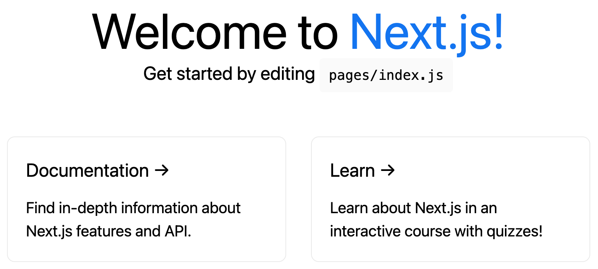

## Create a *next.js* application:
### `yarn create next-app`
###
```shell
yarn create v1.22.10
[1/4] 🔍  Resolving packages...
[2/4] 🚚  Fetching packages...
[3/4] 🔗  Linking dependencies...
[4/4] 🔨  Building fresh packages...
success Installed "create-next-app@10.0.9" with binaries:
      - create-next-app
✔ What is your project named? … next-app
Creating a new Next.js app in /Users/manfredsteiner/Applications/next/next-app.

Installing react, react-dom, and next using yarn...

yarn add v1.22.10
info No lockfile found.
[1/4] 🔍  Resolving packages...
[2/4] 🚚  Fetching packages...
[3/4] 🔗  Linking dependencies...
[4/4] 🔨  Building fresh packages...
success Saved lockfile.
success Saved 174 new dependencies.
info Direct dependencies
├─ next@10.0.9
├─ react-dom@17.0.2
└─ react@17.0.2
info All dependencies
...
✨  Done in 8.74s.

Initialized a git repository.

Success! Created next-app at /Users/manfredsteiner/Applications/next/next-app
Inside that directory, you can run several commands:

  yarn dev
    Starts the development server.

  yarn build
    Builds the app for production.

  yarn start
    Runs the built app in production mode.

We suggest that you begin by typing:

  cd next-app
  yarn dev

✨  Done in 16.25s.
```
## Run it
### `yarn dev`
### 
```shell
yarn run v1.22.10
$ next dev
ready - started server on 0.0.0.0:3000, url: http://localhost:3000
event - compiled successfully
event - build page: /
wait  - compiling...
event - compiled successfully
```
### {:height 351, :width 604}
## The application will be based on *gray-matter* to parse frontmatter, *react-markdown* for converting markdown to HTML and tailwindcss to style it.
## Adding these modules
### Adding react-markdown
#### `yarn add react-markdown`
#### 
```shell
yarn add v1.22.10
[1/4] 🔍  Resolving packages...
[2/4] 🚚  Fetching packages...
[3/4] 🔗  Linking dependencies...
warning " > react-markdown@5.0.3" has unmet peer dependency "@types/react@>=16".
[4/4] 🔨  Building fresh packages...
success Saved lockfile.
success Saved 28 new dependencies.
info Direct dependencies
└─ react-markdown@5.0.3
info All dependencies
...
✨  Done in 5.25s.
```
### Adding *gray-matter*
#### `yarn add -D gray-matter`
#### 
```shell
yarn add v1.22.10
[1/4] 🔍  Resolving packages...
[2/4] 🚚  Fetching packages...
[3/4] 🔗  Linking dependencies...
[4/4] 🔨  Building fresh packages...
success Saved lockfile.
success Saved 10 new dependencies.
info Direct dependencies
└─ gray-matter@4.0.2
info All dependencies
...
✨  Done in 3.25s.
```
### Adding *tailwindcss* and co
#### `yarn add -D tailwindcss postcss postcss-import autoprefixer`
####
```shell
yarn add v1.22.10
[1/4] 🔍  Resolving packages...
[2/4] 🚚  Fetching packages...
[3/4] 🔗  Linking dependencies...
[4/4] 🔨  Building fresh packages...
success Saved lockfile.
success Saved 53 new dependencies.
info Direct dependencies
├─ autoprefixer@10.2.5
├─ postcss-import@14.0.0
├─ postcss@8.2.8
└─ tailwindcss@2.0.4
info All dependencies
...
✨  Done in 6.69s.
```
### Configure *tailwindcss*
#### `npx tailwindcss init -p`
#### 
```shell
   tailwindcss 2.0.4
  
   ✅ Created Tailwind config file: tailwind.config.js
   ✅ Created PostCSS config file: postcss.config.js
```
#### create a stylesheet *styles/tailwind.css*
####
```css
@tailwind base;
@tailwind components;
@tailwind utilities;
```
#### add the stylesheet to *pages/_app.js* and remove the default sheets
####
```javascript
import @styles/tailwind.css
```
#### create a *jsconfig.json* file for some shortcuts
#### 
```json
{
  "compilerOptions": {
    "baseUrl": ".",
    "paths": {
      "@components/*": ["components/*"],
      "@utils/*": ["utils/*"],
      "@assets/*": ["assets/*"],
      "@styles/*": ["styles/*"],
      "@config/*": ["config/*"]
    }
  }
}
```
#### 
### create posts in *content/posts*
#### post
####
```markdown
---
title: First post
description: The first post is the most memorable one.
date: 2020-04-16
---

# h1
## h2
### h3

Normal text
```
### modify default *pages/index.js* to show our posts
###
```javascript
import fs from "fs";
import matter from "gray-matter";

export default function Home({ posts }) {
  return (
    <div>
       {posts.map(({ frontmatter: { title, description, date } }) => (
        <article key={title}>
          <header>
            <h3>{title}</h3>
            <span>{date}</span>
          </header>
          <section>
            <p>{description}</p>
          </section>
        </article>
      ))}
    </div>
  );
}

export async function getStaticProps() {
  const files = fs.readdirSync(`${process.cwd()}/content/posts`);

  const posts = files.map((filename) => {
    const markdownWithMetadata = fs
      .readFileSync(`content/posts/${filename}`)
      .toString();

    const { data } = matter(markdownWithMetadata);

    // Convert post date to format: Month day, Year
    const options = { year: "numeric", month: "long", day: "numeric" };
    const formattedDate = data.date.toLocaleDateString("en-US", options);

    const frontmatter = {
      ...data,
      date: formattedDate,
    };

    return {
      slug: filename.replace(".md", ""),
      frontmatter,
    };
  });

  return {
    props: {
      posts,
    },
  };
}
```
### 
### adding a Layout component *components/layout.js*
###
```javascript
import Link from "next/link";
import { useRouter } from "next/router";

export default function Layout({ children }) {
  const { pathname } = useRouter();
  const isRoot = pathname === "/";

  const header = isRoot ? (
    <h1 className="mb-8">
      <Link href="/">
        <a className="text-6xl font-black text-black no-underline">
          Next.Js Starter Blog
        </a>
      </Link>
    </h1>
  ) : (
    <h1 className="mb-2">
      <Link href="/">
        <a className="text-2xl font-black text-black no-underline">
          Next.Js Starter Blog
        </a>
      </Link>
    </h1>
  );

  return (
    <div className="max-w-screen-sm px-4 py-8 mx-auto">
      <header>{header}</header>
      <main>{children}</main>
      <footer>
        © {new Date().getFullYear()}, Built with{" "}
        <a href="https://nextjs.org/">Next.js</a> &#128293;
      </footer>
    </div>
  );
}
```
### add the layout to *pages/index.js*
### 
```javascript
//...
import Layout from "@components/layout";
//..
export default function Home({ posts }) {
  return (
    <Layout>
      {posts.map(({ frontmatter: { title, description, date }, slug }) => (
        <article key={slug}>
 //..
        </article>
      ))}
    </Layout>
  );
}

//..
```
### 
### Styling the blog index
###
```javascript
export default function Home({ posts }) {
  return (
    <Layout>
      {posts.map(({ frontmatter: { title, description, date } }) => (
        <article key={title}>
          <header>
            <h3 className="mb-1 text-3xl font-semibold text-orange-600">
              {title}
            </h3>
            <span className="mb-4 text-sm">{date}</span>
          </header>
          <section>
            <p className="mb-8">{description}</p>
          </section>
        </article>
      ))}
    </Layout>
  );
}
```
### 
### creating the post page in *pages/post/[slag].js*
###
```javascript
import React from "react";
import fs from "fs";
import path from "path";
import matter from "gray-matter";
import ReactMarkdown from "react-markdown/with-html";
import Layout from "@components/layout";

export default function Post({ content, frontmatter }) {
  return (
    <Layout>
      <article>
        <ReactMarkdown escapeHtml={false} source={content} />
      </article>
    </Layout>
  );
}

export async function getStaticPaths() {
  const files = fs.readdirSync("content/posts");

  const paths = files.map((filename) => ({
    params: {
      slug: filename.replace(".md", ""),
    },
  }));

  return {
    paths,
    fallback: false,
  };
}

export async function getStaticProps({ params: { slug } }) {
   const markdownWithMetadata = fs
    .readFileSync(path.join("content/posts", slug + ".md"))
    .toString();

  const { data, content } = matter(markdownWithMetadata);

  // Convert post date to format: Month day, Year
  const options = { year: "numeric", month: "long", day: "numeric" };
  const formattedDate = data.date.toLocaleDateString("en-US", options);

  const frontmatter = {
    ...data,
    date: formattedDate,
  };

  return {
    props: {
      content: `# ${data.title}\n${content}`,
      frontmatter,
    },
  };
}
```
### modify *pages/index.js* to add links
### 
```javascript
// ...
import Link from "next/link";

export default function Home({ posts }) {
  return (
    <Layout>
      {posts.map(({ frontmatter: { title, description, date }, slug }) => (
        <article key={slug}>
          <header>
            <h3 className="mb-2">
              <Link href={"/post/[slug]"} as={`/post/${slug}`}>
                <a className="text-3xl font-semibold text-orange-600 no-underline">
                  {title}
                </a>
              </Link>
            </h3>
            <span className="mb-4 text-xs">{date}</span>
          </header>
          <section>
            <p className="mb-8">{description}</p>
          </section>
        </article>
      ))}
    </Layout>
  );
}
```
### {:height 165, :width 604}
### Styling markdown with *Typography.js*
#### `yarn add typography react-typography`
####
```shell
yarn add v1.22.10
[1/4] 🔍  Resolving packages...
[2/4] 🚚  Fetching packages...
[3/4] 🔗  Linking dependencies...
warning " > react-markdown@5.0.3" has unmet peer dependency "@types/react@>=16".
warning " > react-typography@0.16.19" has incorrect peer dependency "react@^0.14.0 || ^15.0.0 || ^16.0.0".
[4/4] 🔨  Building fresh packages...
success Saved lockfile.
success Saved 10 new dependencies.
info Direct dependencies
├─ react-typography@0.16.19
└─ typography@0.16.19
info All dependencies
...
✨  Done in 7.07s.
```
#### Install theme and fonts
#### `yarn add typography-theme-sutro typeface-merriweather typeface-open-sans`
####
```shell
yarn add v1.22.10
[1/4] 🔍  Resolving packages...
[2/4] 🚚  Fetching packages...
[3/4] 🔗  Linking dependencies...
warning " > react-markdown@5.0.3" has unmet peer dependency "@types/react@>=16".
warning " > react-typography@0.16.19" has incorrect peer dependency "react@^0.14.0 || ^15.0.0 || ^16.0.0".
[4/4] 🔨  Building fresh packages...
success Saved lockfile.
success Saved 4 new dependencies.
info Direct dependencies
├─ typeface-merriweather@1.1.13
├─ typeface-open-sans@1.1.13
└─ typography-theme-sutro@0.16.19
info All dependencies
...
✨  Done in 7.08s.

```
#### create a typography configuration in *utils/typography.js*
#### 
```javascript
import Typography from "typography";
import SutroTheme from "typography-theme-sutro";

delete SutroTheme.googleFonts;

SutroTheme.overrideThemeStyles = ({ rhythm }, options) => ({
  "h1,h2,h3,h4,h5,h6": {
    marginTop: rhythm(1 / 2),
  },
  h1: {
    fontWeight: 900,
    letterSpacing: "-1px",
  },
});
SutroTheme.scaleRatio = 5 / 2;

const typography = new Typography();

// Hot reload typography in development.
if (process.env.NODE_ENV !== `production`) {
  typography.injectStyles();
}

export default typography;
```
#### create **pages/_document.js* to inject our typography styles
####
```javascript
import Document, { Head, Main, NextScript } from "next/document";
import { TypographyStyle } from "react-typography";
import typography from "../utils/typography";

export default class MyDocument extends Document {
  render() {
    return (
      <html>
        <Head>
          <TypographyStyle typography={typography} />
        </Head>
        <body>
          <Main />
          <NextScript />
        </body>
      </html>
    );
  }
}
```
#### import the typeface font into *pages/_app.js* by adding this line:
#### 
```javascript
// ...
import "typeface-open-sans";
import "typeface-merriweather";
// ...
```
#### Typography.js includes a CSS normalization that collides with tailwind's. Therefore disables tailwind's normalization in *tailwind.config.js**
####
```javascript
corePlugins: {
    preflight: false,
  },
```